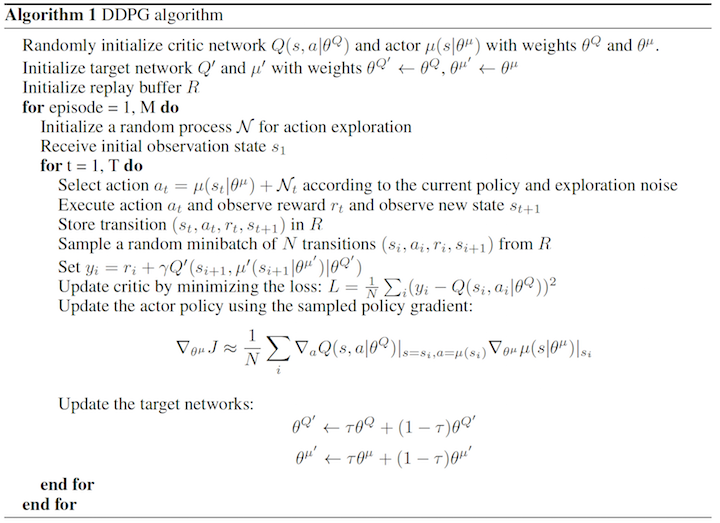

# Project report
### Learning algorithm

* The learning algorithm used is DDPG (Deep Deterministic Policy Gradient) as described in the [paper](https://arxiv.org/abs/1509.02971). It is a kind of actor-critic method but it can be also considered as an approximated [DQN](https://storage.googleapis.com/deepmind-media/dqn/DQNNaturePaper.pdf) method. 

* The DDPG agorithm is explained in the udacity [lecture](https://www.youtube.com/watch?v=0NVOPIyrr98) by Miguel Morales:

	* In DDPG, we use two deep neural networks: actor and critic. The actor is used to approximate optimal policy deterministically. The critic learns to evaluate the optimal action value function by using the actor's best believed action. 

	* We use a regular (or local) and target networks for both the actor and ctitic networks. The regular networks are the most up to date networks that we are training. While target networks are used for prediction to stabilize training.

	* We also use replay buffer to save the state, action, reward, next state, done tuples and soft update to mix a small percentage of the regular or local networks parameters with the target networks parameters. Also a random noise is added with action value of the actor networks for facilitating the exploration.

* The pseudo-code of DDPG is given in the figure below from the [paper](https://arxiv.org/abs/1509.02971):
 


### Parameters used in DDPG algorithm:

* minibatch size(BATCH_SIZE) = 1024         
* replay buffer size(BUFFER_SIZE) = int(1e6)  
* discount factor(GAMMA) = 0.99            
* for soft update of target parameters (TAU) = 1e-3              
* learning rate of the actor (LR_ACTOR) = 1e-3         
* learning rate of the critic (LR_CRITIC) = 1e-3        
              
      

### Network Architecture

The actor networks used in our implementation have the following architecture:

Layer        | (in, out) | Batchnorm | Activation      
-------------|-----------|-----------|-----------
Layer 1 | (State_size,400)|yes|ReLU
Layer 2 | (400,300)|no|ReLU
Layer 3 | (300,action_size)|no|tanh

The critic networks used in our implementation have the following architecture:

Layer        | (in, out) | Batchnorm | Activation      
-------------|-----------|-----------|-----------
Layer 1 | (State_size,400)|yes|ReLU
Layer 2 | (400+action_size,300)|no|ReLU
Layer 3 | (300,1)|no|-


### Results


```
Episode 1	Total Average Score: 0.17	Mean: 0.17	Min: 0.00	Max: 0.45	Duration: 129.22
Episode 2	Total Average Score: 0.21	Mean: 0.25	Min: 0.00	Max: 0.99	Duration: 136.48
Episode 3	Total Average Score: 0.36	Mean: 0.65	Min: 0.17	Max: 2.13	Duration: 153.56
Episode 4	Total Average Score: 0.48	Mean: 0.85	Min: 0.00	Max: 2.31	Duration: 140.34
Episode 5	Total Average Score: 0.55	Mean: 0.84	Min: 0.07	Max: 1.95	Duration: 121.83
Episode 6	Total Average Score: 0.61	Mean: 0.90	Min: 0.26	Max: 2.03	Duration: 130.46
Episode 7	Total Average Score: 0.67	Mean: 1.04	Min: 0.00	Max: 2.64	Duration: 152.40
Episode 8	Total Average Score: 0.74	Mean: 1.20	Min: 0.44	Max: 3.42	Duration: 121.77
Episode 9	Total Average Score: 0.85	Mean: 1.77	Min: 0.66	Max: 2.81	Duration: 117.25
Episode 10	Total Average Score: 1.01	Mean: 2.44	Min: 0.00	Max: 5.62	Duration: 119.60
Episode 10	Total Average Score: 1.01
Episode 11	Total Average Score: 1.12	Mean: 2.18	Min: 0.55	Max: 3.62	Duration: 117.20
Episode 12	Total Average Score: 1.26	Mean: 2.81	Min: 1.50	Max: 5.75	Duration: 119.14
Episode 13	Total Average Score: 1.46	Mean: 3.93	Min: 1.62	Max: 7.02	Duration: 119.40
Episode 14	Total Average Score: 1.61	Mean: 3.56	Min: 1.08	Max: 7.53	Duration: 119.65
Episode 15	Total Average Score: 1.81	Mean: 4.57	Min: 1.87	Max: 9.34	Duration: 124.61
Episode 16	Total Average Score: 2.10	Mean: 6.44	Min: 1.50	Max: 10.45	Duration: 128.51
Episode 17	Total Average Score: 2.38	Mean: 6.94	Min: 1.32	Max: 12.94	Duration: 127.45
Episode 18	Total Average Score: 2.84	Mean: 10.58	Min: 1.51	Max: 18.09	Duration: 128.58
Episode 19	Total Average Score: 3.57	Mean: 16.73	Min: 5.07	Max: 26.85	Duration: 131.41
Episode 20	Total Average Score: 4.20	Mean: 16.11	Min: 4.98	Max: 31.34	Duration: 129.61
Episode 20	Total Average Score: 4.20
Episode 21	Total Average Score: 5.09	Mean: 22.92	Min: 10.90	Max: 34.22	Duration: 130.84
Episode 22	Total Average Score: 6.12	Mean: 27.73	Min: 17.47	Max: 33.47	Duration: 133.03
Episode 23	Total Average Score: 7.31	Mean: 33.49	Min: 29.08	Max: 38.13	Duration: 137.38
Episode 24	Total Average Score: 8.31	Mean: 31.34	Min: 21.08	Max: 35.85	Duration: 135.91
Episode 25	Total Average Score: 9.34	Mean: 33.98	Min: 23.67	Max: 38.52	Duration: 137.55
Episode 26	Total Average Score: 10.34	Mean: 35.29	Min: 29.76	Max: 39.52	Duration: 139.98
Episode 27	Total Average Score: 11.32	Mean: 36.93	Min: 31.04	Max: 39.62	Duration: 152.14
Episode 28	Total Average Score: 12.21	Mean: 36.20	Min: 32.54	Max: 39.59	Duration: 165.21
Episode 29	Total Average Score: 13.11	Mean: 38.37	Min: 35.75	Max: 39.47	Duration: 160.86
Episode 30	Total Average Score: 13.93	Mean: 37.79	Min: 35.62	Max: 39.54	Duration: 163.22
Episode 30	Total Average Score: 13.93
Episode 31	Total Average Score: 14.74	Mean: 38.79	Min: 36.95	Max: 39.67	Duration: 162.41
Episode 32	Total Average Score: 15.47	Mean: 38.36	Min: 36.31	Max: 39.62	Duration: 165.73
Episode 33	Total Average Score: 16.17	Mean: 38.57	Min: 35.89	Max: 39.56	Duration: 167.59
Episode 34	Total Average Score: 16.84	Mean: 38.89	Min: 36.95	Max: 39.64	Duration: 169.04
Episode 35	Total Average Score: 17.46	Mean: 38.30	Min: 35.72	Max: 39.59	Duration: 171.81
Episode 36	Total Average Score: 18.02	Mean: 37.78	Min: 36.59	Max: 38.88	Duration: 174.00
Episode 37	Total Average Score: 18.55	Mean: 37.53	Min: 34.86	Max: 39.10	Duration: 175.31
Episode 38	Total Average Score: 19.08	Mean: 38.94	Min: 36.90	Max: 39.60	Duration: 178.98
Episode 39	Total Average Score: 19.55	Mean: 37.12	Min: 34.74	Max: 39.11	Duration: 180.45
Episode 40	Total Average Score: 20.03	Mean: 38.77	Min: 37.26	Max: 39.59	Duration: 190.82
Episode 40	Total Average Score: 20.03
Episode 41	Total Average Score: 20.48	Mean: 38.47	Min: 36.18	Max: 39.55	Duration: 189.62
Episode 42	Total Average Score: 20.91	Mean: 38.75	Min: 36.44	Max: 39.57	Duration: 190.79
Episode 43	Total Average Score: 21.33	Mean: 38.72	Min: 36.50	Max: 39.63	Duration: 198.43
Episode 44	Total Average Score: 21.72	Mean: 38.76	Min: 35.28	Max: 39.51	Duration: 198.43
Episode 45	Total Average Score: 22.09	Mean: 38.46	Min: 36.69	Max: 39.57	Duration: 202.93
Episode 46	Total Average Score: 22.45	Mean: 38.35	Min: 35.59	Max: 39.48	Duration: 203.96
Episode 47	Total Average Score: 22.80	Mean: 38.89	Min: 37.60	Max: 39.62	Duration: 206.22
Episode 48	Total Average Score: 23.13	Mean: 38.75	Min: 36.86	Max: 39.49	Duration: 208.79
Episode 49	Total Average Score: 23.45	Mean: 38.80	Min: 37.72	Max: 39.54	Duration: 219.80
Episode 50	Total Average Score: 23.75	Mean: 38.58	Min: 36.73	Max: 39.64	Duration: 214.47
Episode 50	Total Average Score: 23.75
Episode 51	Total Average Score: 24.05	Mean: 38.93	Min: 37.52	Max: 39.59	Duration: 211.62
Episode 52	Total Average Score: 24.33	Mean: 38.61	Min: 36.29	Max: 39.60	Duration: 210.00
Episode 53	Total Average Score: 24.60	Mean: 38.90	Min: 38.21	Max: 39.48	Duration: 213.02
Episode 54	Total Average Score: 24.87	Mean: 38.66	Min: 35.32	Max: 39.67	Duration: 208.06
Episode 55	Total Average Score: 25.10	Mean: 37.57	Min: 35.80	Max: 39.46	Duration: 189.85
Episode 56	Total Average Score: 25.34	Mean: 38.64	Min: 36.79	Max: 39.52	Duration: 189.70
Episode 57	Total Average Score: 25.57	Mean: 38.67	Min: 36.96	Max: 39.59	Duration: 191.01
Episode 58	Total Average Score: 25.80	Mean: 38.67	Min: 37.86	Max: 39.40	Duration: 199.35
Episode 59	Total Average Score: 26.01	Mean: 38.27	Min: 37.26	Max: 39.21	Duration: 231.19
Episode 60	Total Average Score: 26.23	Mean: 39.01	Min: 37.26	Max: 39.56	Duration: 224.42
Episode 60	Total Average Score: 26.23
Episode 61	Total Average Score: 26.43	Mean: 38.75	Min: 37.52	Max: 39.61	Duration: 218.86
Episode 62	Total Average Score: 26.64	Mean: 39.18	Min: 37.21	Max: 39.60	Duration: 204.77
Episode 63	Total Average Score: 26.83	Mean: 38.59	Min: 37.37	Max: 39.55	Duration: 194.78
Episode 64	Total Average Score: 27.01	Mean: 38.75	Min: 36.61	Max: 39.41	Duration: 220.01
Episode 65	Total Average Score: 27.20	Mean: 38.90	Min: 37.61	Max: 39.56	Duration: 218.04
Episode 66	Total Average Score: 27.37	Mean: 38.95	Min: 38.13	Max: 39.56	Duration: 216.96
Episode 67	Total Average Score: 27.54	Mean: 38.74	Min: 36.93	Max: 39.38	Duration: 195.51
Episode 68	Total Average Score: 27.71	Mean: 38.86	Min: 36.84	Max: 39.65	Duration: 184.91
Episode 69	Total Average Score: 27.86	Mean: 38.20	Min: 36.31	Max: 39.14	Duration: 199.25
Episode 70	Total Average Score: 28.02	Mean: 38.73	Min: 37.68	Max: 39.61	Duration: 200.09
Episode 70	Total Average Score: 28.02
Episode 71	Total Average Score: 28.16	Mean: 38.46	Min: 36.74	Max: 39.49	Duration: 218.84
Episode 72	Total Average Score: 28.32	Mean: 39.41	Min: 38.89	Max: 39.63	Duration: 210.52
Episode 73	Total Average Score: 28.47	Mean: 39.00	Min: 37.76	Max: 39.60	Duration: 258.35
Episode 74	Total Average Score: 28.61	Mean: 39.16	Min: 37.89	Max: 39.64	Duration: 266.74
Episode 75	Total Average Score: 28.75	Mean: 39.23	Min: 38.50	Max: 39.62	Duration: 206.27
Episode 76	Total Average Score: 28.88	Mean: 38.79	Min: 37.51	Max: 39.54	Duration: 247.26
Episode 77	Total Average Score: 29.02	Mean: 39.36	Min: 38.28	Max: 39.65	Duration: 199.31
Episode 78	Total Average Score: 29.14	Mean: 38.05	Min: 36.95	Max: 39.50	Duration: 201.78
Episode 79	Total Average Score: 29.26	Mean: 39.01	Min: 38.11	Max: 39.58	Duration: 203.68
Episode 80	Total Average Score: 29.37	Mean: 38.06	Min: 36.25	Max: 39.35	Duration: 215.85
Episode 80	Total Average Score: 29.37
Episode 81	Total Average Score: 29.49	Mean: 39.29	Min: 38.18	Max: 39.63	Duration: 218.57
Episode 82	Total Average Score: 29.61	Mean: 38.95	Min: 37.30	Max: 39.62	Duration: 218.78
Episode 83	Total Average Score: 29.72	Mean: 38.55	Min: 37.92	Max: 39.57	Duration: 223.45
Episode 84	Total Average Score: 29.82	Mean: 38.47	Min: 37.27	Max: 39.62	Duration: 225.91
Episode 85	Total Average Score: 29.93	Mean: 38.98	Min: 38.35	Max: 39.51	Duration: 213.08
Episode 86	Total Average Score: 30.03	Mean: 38.76	Min: 35.46	Max: 39.61	Duration: 225.08
Episode 87	Total Average Score: 30.13	Mean: 38.16	Min: 35.93	Max: 39.56	Duration: 224.88
Episode 88	Total Average Score: 30.22	Mean: 38.09	Min: 37.07	Max: 39.55	Duration: 225.03
Episode 89	Total Average Score: 30.31	Mean: 38.21	Min: 37.23	Max: 38.90	Duration: 224.55
Episode 90	Total Average Score: 30.38	Mean: 36.97	Min: 34.88	Max: 39.44	Duration: 222.01
Episode 90	Total Average Score: 30.38
Episode 91	Total Average Score: 30.46	Mean: 37.89	Min: 35.80	Max: 39.42	Duration: 222.78
Episode 92	Total Average Score: 30.54	Mean: 37.38	Min: 35.46	Max: 39.12	Duration: 230.88
Episode 93	Total Average Score: 30.62	Mean: 38.01	Min: 35.60	Max: 39.62	Duration: 222.69
Episode 94	Total Average Score: 30.68	Mean: 36.92	Min: 33.76	Max: 38.61	Duration: 220.62
Episode 95	Total Average Score: 30.74	Mean: 36.27	Min: 34.79	Max: 38.33	Duration: 216.57
Episode 96	Total Average Score: 30.80	Mean: 36.43	Min: 26.35	Max: 38.49	Duration: 271.36
Episode 97	Total Average Score: 30.88	Mean: 37.89	Min: 36.25	Max: 39.19	Duration: 294.64
Episode 98	Total Average Score: 30.95	Mean: 37.72	Min: 35.94	Max: 38.63	Duration: 404.94
Episode 99	Total Average Score: 31.01	Mean: 37.62	Min: 35.80	Max: 39.27	Duration: 323.25
Episode 100	Total Average Score: 31.09	Mean: 38.40	Min: 36.73	Max: 39.44	Duration: 314.37
Episode 100	Total Average Score: 31.09
Problem Solved after 100 epsisodes!! Total Average score: 31.09
```


### Trained Agent


### Ideas for future work

